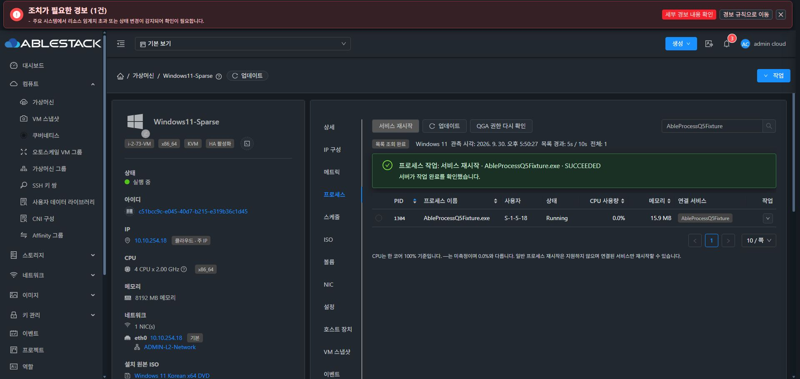
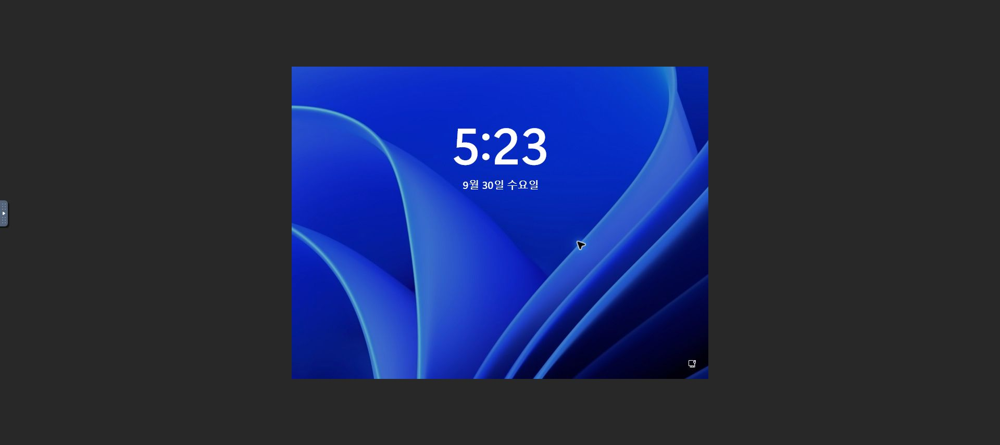

# Qemu #65 실제 패키지·VM 검증 기록

검증일: 2026-09-30, 31번 테스트 클러스터. [Qemu #65](https://github.com/ablecloud-team/ablestack-qemu-exec-tools/issues/65), [Epic #1170](https://github.com/ablecloud-team/ablestack-cloud/issues/1170), [Qemu PR #82](https://github.com/ablecloud-team/ablestack-qemu-exec-tools/pull/82), [Cloud PR #1197](https://github.com/ablecloud-team/ablestack-cloud/pull/1197).

## 빌드·배포 식별

- Qemu 실행 코드: `c439f930e030fc75e4eae7be59956efd1835c2b4`. [GitHub Actions 36688611885](https://github.com/dhslove/ablestack-qemu-exec-tools/actions/runs/36688611885) 전체 7 job SUCCESS. Python 105개, Windows 네이티브·정책, RPM/DEB clean host install/reinstall, hangctl/FTCTL tombstone/firewalld/ISO 패키징 gate 통과.
- RPM/DEB/Windows MSI 및 Rocky/Ubuntu/Debian/Windows 오프라인 다중 ISO를 같은 run에서 생성했다. Linux launcher와 Windows DLL을 한 번 빌드하여 모든 패키지에 넣고 실제 바이트·승인 전체 묶음을 비교했다.
- 10.10.31.1/2/3에 `ablestack-qemu-exec-tools-0.10.0-1.epic36688611885.el9.el9.x86_64` 배포, 설치 파일 검증 통과. 같은 승인 카탈로그 SHA-256은 `911e68d86c20a2271640b78e8d5e27a13b288de88cb427d8d1b4df4469f9598c`이다.
- 이 기록과 함께 source catalog에 위 Actions가 생성한 정확한 Windows 전체 묶음 2개를 승격했다. 기존 승인 묶음은 보존하며 source catalog와 세 호스트 설치 catalog는 바이트 단위로 일치한다. 문서·카탈로그 승격 커밋은 검증된 실행 코드 변경이 아니다. 다음 빌드에서도 현재 게스트를 신뢰하도록 남기는 메타데이터이다.
- Cloud `88a7f5896a120cdfb58da41abbace8419fdcca60`: WSL ext4의 변경 KVM 모듈 23개 테스트·package 통과. 세 호스트의 KVM JAR에 변경 Guard/Probe/Wrapper 클래스와 readiness 리소스를 배포하고 설치 바이트와 새 Mold Agent PID를 확인했다. 이번 Q6 보완에서 management/UI를 재배포하지 않았다.

파일 해시는 다운로드 artifact ZIP의 digest가 아닌 실제 설치 파일의 SHA-256이다. 상세: [build-and-artifacts.json](build-and-artifacts.json).

| 파일 | SHA-256 |
| --- | --- |
| ablestack-qemu-exec-tools-0.10.0-1.epic36688611885.el9.el9.x86_64.rpm | `13c8a5a412427854742d10d619288c1872ccf9608e0df9f9394a1dc1dc4a4ab2` |
| ablestack-qemu-exec-tools_0.10.0-1.epic36688611885.deb | `7b87c271675d6f06b83e2fa62b21773f5603e7217c41655941cd70ccef49dc8b` |
| ABLESTACK-ProcessTools.msi | `edb5a8343274b5f26a19d503d3c097eb4970c2a5fec25c566c09bdfe30c287d4` |
| ABLESTACK-Tools-rocky-process-6-c439f93.iso | `ecb954a4a71c3eb2f1910fb0b6f990b4c9707f3498a45b9fc06203cac467eade` |
| ABLESTACK-Tools-ubuntu-process-6-c439f93.iso | `12a21a281b7a3fa0a5b49446809df5833a41668706e6656f317b5525500db1fd` |
| ABLESTACK-Tools-debian-process-6-c439f93.iso | `15485be053ee54e6d21a54a9ad8b12d00b285ebab198c46dc90e5fcbd71d1c79` |
| ABLESTACK-Tools-windows-process-6-c439f93.iso | `cf60f1158cb44acb9f3499b43019a8b64b34761d356fd024671aef23867a4a25` |

## 제공된 12대 런타임 결과

최종 네 계열 ISO를 12대에 연결하고 루트 `install-linux.sh`/`install.bat`를 실행했다. Linux 8대 READY, Windows 4대 exit 0/QGA Running 이후 실제 READY·목록까지 확인했다. Windows 설치 로그는 NetKVM/vioserial/Balloon 현재 장치 binding을 확인했다. Rocky 8 재적용은 changed=false/restartPerformed=false로 멱등성을 확인했다.

다음 수치는 한 시점의 전체 페이지를 모은 목록과 CPU 관측 개수다. 각 VM의 독립된 raw RPC probe는 guest-exec/status와 file open/write/read/seek/flush/close를 실제 실행하고 임시 파일을 지웠다. RPC gate의 featureReady=false는 RPC 검사만으로 제품 READY를 부여하지 않는다는 뜻이며, 별도 Cloud capability와 실제 snapshot은 모두 READY/OK였다.

| 실제 게스트 OS | QGA | 목록 / CPU 관측 | RPC 8개 실제 실행 | 일회용 대상의 실제 후조건 |
| --- | --- | --- | --- | --- |
| rocky 10.2 | 10.1.0 | 237 / 237 | PASS | 정상 종료·강제 종료·서비스 재시작 PASS |
| rocky 9.8 | 10.1.0 | 131 / 131 | PASS | 정상 종료·강제 종료·서비스 재시작 PASS |
| rocky 8.10 | 6.2.0 | 119 / 119 | PASS | 정상 종료·강제 종료·서비스 재시작 PASS |
| ubuntu 26.04 | 10.2.1 | 130 / 130 | PASS | 정상 종료·강제 종료·서비스 재시작 PASS |
| ubuntu 24.04 | 8.2.2 | 118 / 118 | PASS | 정상 종료·강제 종료·서비스 재시작 PASS |
| ubuntu 22.04 | 6.2.0 | 121 / 121 | PASS | 정상 종료·강제 종료·서비스 재시작 PASS |
| debian 13 | 10.0.13 | 165 / 165 | PASS | 정상 종료·강제 종료·서비스 재시작 PASS |
| debian 12 | 7.2.22 | 159 / 159 | PASS | 정상 종료·강제 종료·서비스 재시작 PASS |
| Windows 2025 | 110.2.3 | 84 / 84 | PASS | 강제 종료·서비스 재시작 PASS |
| Windows 2022 | 110.2.3 | 97 / 97 | PASS | 강제 종료·서비스 재시작 PASS |
| Windows 2019 | 110.2.3 | 92 / 92 | PASS | 강제 종료·서비스 재시작 PASS |
| Windows 11 | 110.2.3 | 89 / 89 | PASS | 강제 종료·서비스 재시작 PASS |

총 32개 작업에서 Cloud SUCCEEDED/VERIFIED와 게스트 PID 소멸 또는 서비스 PID/Invocation 변경이 일치했다. Windows 정상 종료는 허용 작업에 없으므로 강제 종료·서비스 재시작 2개를 검증했다. 기존 시스템 서비스에 신호를 보내지 않고 전용 fixture를 사용하고 제거했다. [matrix.json](matrix.json), [rpc-probes.json](rpc-probes.json), [actions.json](actions.json).

Linux 게스트의 `6dcb57e`와 최종 `c439f93` 산출물 실행 파일은 동일 바이트다. 이전 승인 ID가 표시되는 것은 첫 번째 일치한 전체 묶음 ID를 보고하기 때문이며, 호스트 현재 소스와 문자열 버전이 같아야 한다는 제한은 없다. Windows 4대 작업은 최신 c439 DLL 설치 이후 다시 수행했다.

## Windows 11 원인 입증과 브라우저 검증

데스크톱 로그인은 요구 조건이 아니다. 검증 마지막에 Win32_ComputerSystem.UserName=null, QGA Auto/LocalSystem/Session 0 Running, 목록 87개/OK, 전용 테스트 서비스 0개를 확인했다. [로그아웃 증거](windows11-logged-out-final.json).

실제 실패는 두 가지였다.

1. 작업이 게스트에서 성공하여 journal에 SUCCEEDED가 남아도, Get-FileHash 모듈 autoload의 한국어 CLIXML progress가 CP949 stderr로 반환되어 transport의 엄격한 UTF-8 검사에 걸렸다. 결과는 encoding_loss=true/CHECK_FAILED·UNKNOWN이었으며 로그인 여부를 원인으로 단정할 수 없었다. **해시 검증 전부터** ProgressPreference=SilentlyContinue와 UTF-8을 설정하여 수정했다. 양쪽 출력의 엄격한 검증과 승인 해시 비교는 유지한다. 기존 UNKNOWN `8d535caa-0488-4e43-ac02-4a579b6926ef`는 변경 명령을 재실행하지 않고 guest journal 조회만으로 SUCCEEDED를 회수하고 marker/fence를 해제했다. 수정 후 stderr 빈 값·encoding_loss=false: [응답](windows11-query-encoding-fixed.json).
2. Mold Agent의 호스트 flock 경합은 guest dispatch 전에도 셸 exit 3 예외가 되어 UNKNOWN으로 처리됐다. 실제 같은 VM/요청에 외부 lock을 잡아 전후를 비교했다. 이제 이 특정 경로만 BUSY/NOT_STARTED로 반환하며 dispatch 이후 timeout·응답 유실은 UNKNOWN을 유지한다. [경합 응답](windows11-lock-reproduction-after.json).

추가로 실행 전 부모 채널 종료 시 읽기 요청의 자기 marker만 제거한다. 실행 여부가 불분명한 marker는 보존한다. 원래 UNKNOWN 테스트 작업 `20e6bbfd-c001-4675-8990-0daddde7211f`는 별도 검증된 게스트 재부팅 후 fence만 정리했고 원본 UNKNOWN 이력은 보존했다. 이는 제품 자동 복구 API 또는 재실행 성공으로 세지 않는다.

브라우저의 Windows 11 프로세스 탭에서 전용 서비스 선택→상단 서비스 재시작→표준 확인 대화상자→실행을 수행했다. UI SUCCEEDED와 실제 PID 2888→1304/Running이 일치하고 전후 로그인 사용자도 null이었다. 이후 전용 서비스를 제거했다. [실제 후조건](windows11-ui-service-restart.json).

## Linux 및 안전성 회귀

- Rocky 8 QGA 6.2의 BLACKLIST_RPC/--blacklist를 실제 복구하여 RPC 8개를 실행했다. unrelated RPC/fsfreeze/관리자 설정은 보존한다. Enforcing 상태에서 3개 작업 후조건 통과.
- Rocky 8 커널의 pidfd_open ENOSYS를 확인했다. O_NOFOLLOW로 고정한 /proc/PID 디렉터리 FD의 pidfd_send_signal 경로를 사용하며 숫자 PID kill fallback은 없다. identity/startTicks/command fingerprint 검사를 유지한다.
- Linux service mapping은 systemctl show '*.service'로 unit을 명시한다. manager 속성만 반환한 빈 연결을 정상 관측으로 처리하던 결함을 수정했다.
- Debian 12·13도 공통 selector 지원 계약으로 실행하며 ID_LIKE로 미지원 OS를 허용하지 않는다. 등록 OS와 실제 OS 불일치의 ISO 선택 차단은 유지했다.
- Linux read/action 변조와 Windows 승인 DLL을 서로 다른 묶음으로 혼합한 상태를 실제 생성했다. read 변조는 TOOLS_REQUIRED, action/mixed는 list만 허용하고 변경 작업 권한은 거부했다. 원본 복원 후 권한을 다시 확인했다. [묶음 거부](bundle-security.json).
- PID 1 보호 대상과 이미 종료한 fixture는 PROTECTED_TARGET/STALE_IDENTITY, FAILED/NOT_STARTED로 거부했다. 완료 requestId 재제출은 원래 operationId/completedAt을 반환하여 새 변경 작업이 없음을 확인했다. [guard 결과](action-guards.json).
- Global vm.process.management.enabled=false 시 API와 목록 수집 거부, 원래 true 복원 확인. [feature flag](global-disabled.json).
- Debian 12: host1→host2→host1, Windows Server 2022: host2→host1→host2 실제 이동. 게스트 boot/hash 묶음을 보존한 채 READY/목록과 추가 5개 실제 작업 후조건 통과. Windows 11은 제시된 다른 호스트가 migration suitable이 아니어서 강제 이동하지 않았다. [이동 증거](migration.json).
- 최종 12대 Running, guest-network-get-interfaces 관측 가능, 대상 host marker 및 Cloud active operation 0. 세 Mold Agent active, 기존 FT/hangctl 설치 파일과 timer 상태 보존, agent.properties의 비주석 설정 동일(재시작 시 시각 주석만 변경), /client/ HTTP 200. 네트워크 인터페이스 관측은 모든 외부 경로의 통신 PASS를 의미하지 않는다. [최종 상태](health-final.json).

## 범위와 다음 인계

Ubuntu 24는 QGA 패키지가 없는 상태를 만든 뒤 ISO의 오프라인 패키지로 실제 신규 설치하고 READY/목록을 확인했다. 나머지 VM은 기존 설치 상태에서 업그레이드·repair·재적용을 검증했으며, 12대 모두의 완전한 신규 OS/VirtIO 설치를 재검증했다고 주장하지 않는다. 제공된 Rocky VM은 RHEL 구독·패키지 설치 증거가 아니므로 실제 RHEL 설치는 미검증이다. Debian 11은 제외한다.

Actions의 입력/출력·크기/시간 경계 테스트와 실제 12대 목록을 통과했다. 10,000행 실환경 부하, 모든 tenant/RBAC 조합, Cloud 작업 중 재시작·응답 유실, 전체 lifecycle/네트워크 및 사용자 승인 방식 FT/DR 체인, 일반/다크 UI 전체 경로와 운영 rollback은 [Cloud #1177(C7)](https://github.com/ablecloud-team/ablestack-cloud/issues/1177)의 잔여 통합 gate다. 이번 결과를 전체 MVP/전체 FT 체인 PASS 또는 전체 Cloud 빌드 PASS로 표기하지 않는다.

관련 이슈는 PR 병합 및 남은 acceptance 판정 전 OPEN으로 유지하고 기존 Epic PR 2개에 누적한다. Cloud PR 검토는 사용자 요청대로 Conflict/License만 판정하며 기타 CI는 완료 근거로 사용하지 않는다.
